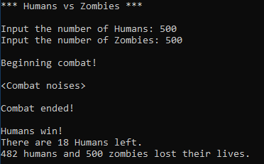

# Battle
A C++ Basic Practice Project as shown in this [video](https://www.youtube.com/watch?v=TH7plF4UT_E&list=PLSPw4ASQYyynKPY0I-QFHK0iJTjnvNUys&index=10&t=225s&ab_channel=MakingGamesWithBen). It simulates a battle and gives the result based on some random events.

I just took the idea and wrote all the codes myself. Here is a screenshot - 

 

